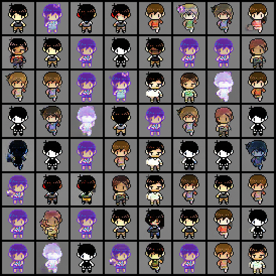
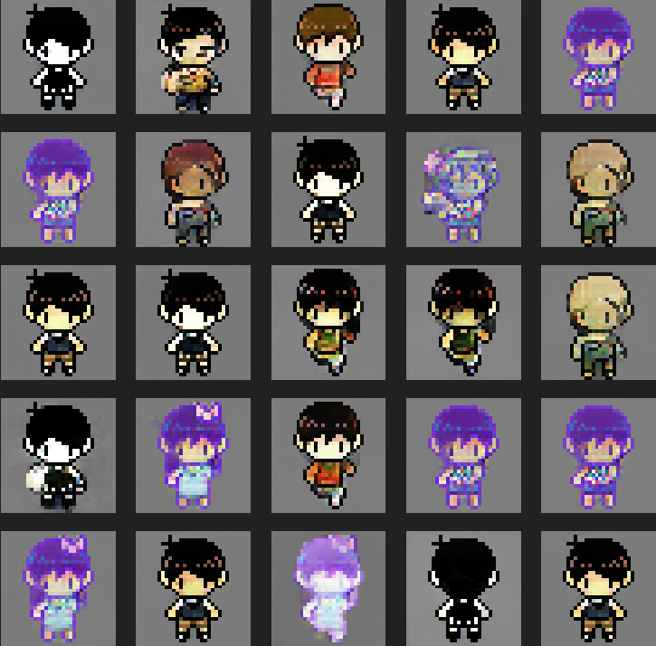

# OMORI GAN

Generate OMORI character sprite with Generative Adversarial Networks (GAN) using PyTorch Lightning.

## Example generated image

<details>
<summary>Spoiler warning: Example of generated sprite</summary>

> Sunny hiding his hands


> Kel with different uniform


> New NPC?


> Sample of generated image during GAN training



> Example of generated sprite from https://ilos-vigil.github.io/OMORI-GAN




</details>

## Setup

All code in this repository only tested with Python 3.8 on Debian-based Linux distribution. I assume you already install CUDA, cuDNN and other library/driver required to run PyTorch. If you use RTX 3000, you may need head to https://pytorch.org/get-started/locally/ and install PyTorch with Compute Platform CUDA 11.3 or 11.6.

```
git clone https://github.com/ilos-vigil/OMORI-GAN
cd OMORI-GAN
python3.8 -m venv .venv
source .venv/bin/activate
pip install -r requirements.txt
```

## Directory description

> More specific setup or manual is available on each directory!

* `preprocessing` contain script to decrypt and preprocess data from OMORI game.
* `gan_model` contain code to train DCGAN model. Some model weight and run history also included.
* `other_experiment` contains report of creating GAN model using different ready-to-use model.
* `docs` contain source code of static webpage which generate OMORI character sprite. Visit https://ilos-vigil.github.io/OMORI-GAN for live demo.

## What is OMORI?

Here's description from [OMORI official site](https://omori-game.com/en/about)

Explore a strange world full of colorful friends and foes. Navigate through the vibrant and the mundane in order to uncover a forgotten past. When the time comes, the path you've chosen will determine your fate... and perhaps the fate of others as well.

P.S. It's strongly recommended to play the game blindly (without looking for any article, video or review).

## License

This project is licensed under the terms of the MIT License. But i do not claim any ownership of any generated image.

## Acknowledgements

OMORI GAN makes use of the following project and article.

* [Machine Learning with PyTorch and Scikit-Learn Book Chapter 17 Part 2](https://github.com/rasbt/machine-learning-book/blob/main/ch17/ch17_part2.ipynb) for WGAN-GP and small part of DCGAN implementation.
* [mv_decoder.py](https://f95zone.to/threads/rpg-maker-mv-mz-asset-decoder-python-based.80599) by kin-kun. Take note the author doesn't include or mention any license on either source code. It's included on this repository for archival purpose.
* [DiffAugment](https://github.com/mit-han-lab/data-efficient-gans/blob/master/DiffAugment_pytorch.py) with small modification to remove warning message on PyTorch 1.12.1.
* [Deconvolution and Checkerboard Artifacts](https://distill.pub/2016/deconv-checkerboard/) for upscale-convolutional approach.